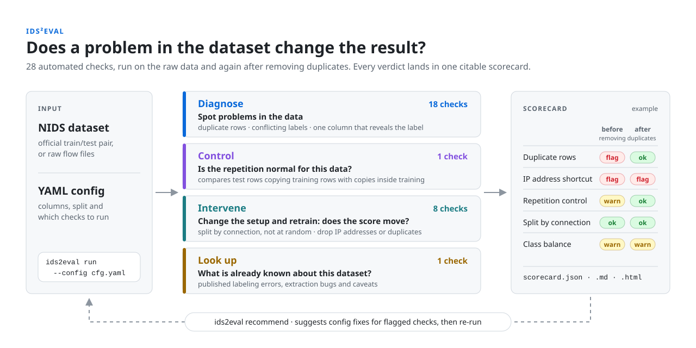

# IDS<sup>2</sup>Eval

**[hashtagRR.github.io/IDS2Eval](https://hashtagRR.github.io/IDS2Eval)**

[](https://doi.org/10.5281/zenodo.23217300)

<p align="center">
  
</p>

A config-driven toolkit that audits network intrusion detection (NIDS)
datasets before you trust a result on them. It runs 28 checks for
duplicated rows, label conflicts, one-column shortcuts and split
problems, tests whether a suspected problem actually changes the
accuracy, and records every verdict in a citable scorecard.

*IDS<sup>2</sup> reads both ways: **I**ntrusion **D**etection **S**ystems and
**I**ntrusion **D**ata **S**ets.*

## Quickstart

```bash
python3 -m venv venv && venv/bin/pip install -e ".[plots]"
venv/bin/ids2eval-dashboard                      # web UI with a pre-filled config editor
venv/bin/ids2eval run --config my_config.yaml    # or the CLI, with a config like the one below
```

```yaml
# my_config.yaml: any NIDS dataset in CSV or Parquet form
dataset:
  name: my-dataset
  raw_files: ["data.csv"]
schema:
  label_column: Label
```

Windows and troubleshooting: [INSTALL.md](INSTALL.md).

## Documentation

| Guide | What it covers |
|---|---|
| [Usage](guide/usage.md) | the CLI, the dashboard, output files, caching, reproducing a run, and the Python API |
| [Config fields](configs/README.md) | every config field, with its default and an example |
| [Configuration notes](guide/configuration.md) | the reasoning behind non-obvious fields, and larger worked examples |
| [Checks](guide/checks.md) | what each of the 28 checks does, the research behind it, and the scorecard's verdict rule |
| [Example scorecards](examples/) | real scorecards for eight widely used datasets, from UNSW-NB15 to BoT-IoT |
| [Paper results](results/README.md) | configurations, scorecards and analysis outputs behind the accompanying paper |
| [Known issues](guide/contributing-known-issues.md) | how to add a curated known issue or extractor fingerprint |
| [Install guide](INSTALL.md) | platform setup, extras, tests and lint, including Windows |
| [Project site](https://hashtagRR.github.io/IDS2Eval) | the project's overview page |

## Versions

- **`main`** (latest): adds the validation scripts and results of the paper's revision (host-disjoint splits, workflow ablation, interval coverage, a comparison with Flood et al.'s released heuristics); to be archived as v0.2.1.
- **`v0.2.0`** ([10.5281/zenodo.23217301](https://doi.org/10.5281/zenodo.23217301)): the code, configurations and results behind the accompanying paper on auditing NIDS benchmarks (in preparation).

IDS<sup>2</sup>Eval grew out of the dataset-auditing code of research on
machine-learning-based network intrusion detection, generalized into a
dataset-independent toolkit.

## Citing

Cite the version you used. The concept DOI
[10.5281/zenodo.23217300](https://doi.org/10.5281/zenodo.23217300)
always resolves to the latest version.

> Relapanawa, R. (2026). *IDS2Eval v0.2.0* (Version v0.2.0) [Computer software]. Zenodo. https://doi.org/10.5281/zenodo.23217301

## License

AGPL-3.0. See [LICENSE](LICENSE).
