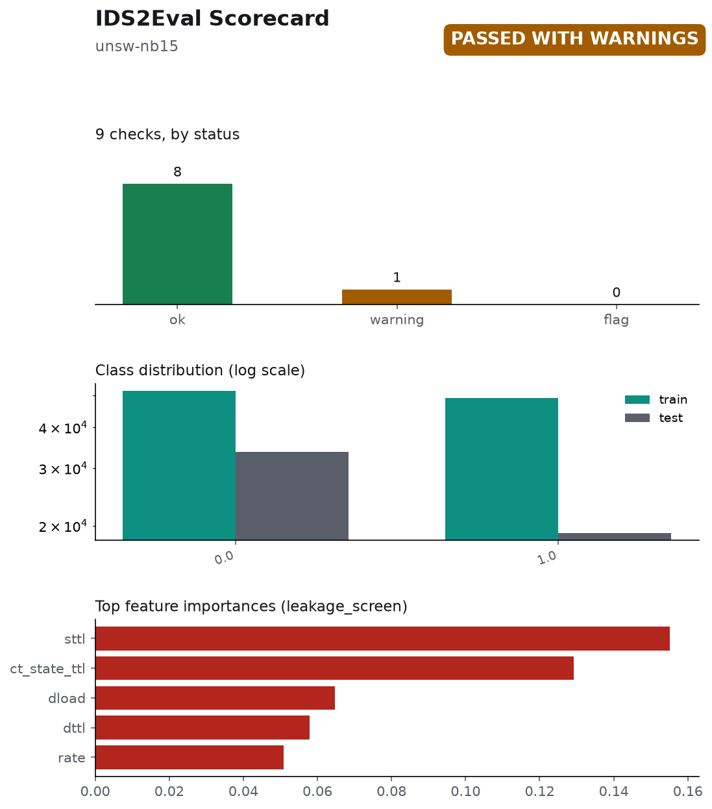

# IDS2Eval Scorecard

**Dataset:** unsw-nb15
**Overall status:** ⚠️ Passed with warnings
**Generated:** 2026-09-06T18:06:52.387935+00:00
**IDS2Eval version:** 0.1.0 (git 924fb79)
**Scorecard schema version:** 1.0
**Audit stage:** after dedup

## Checks

| Check | Status | Summary |
|---|---|---|
| `dedup_check` | ✅ ok | train duplicates: 0 (0.00%); test rows leaking a train feature-match: 0 (0.00%); test-internal duplicates: 0 |
| `leakage_screen` | ✅ ok | no single feature or pair dominates importance (top1=15.5%, top2=28.4%) |
| `identity_column_flag` | ✅ ok | no id_like_columns configured |
| `homogeneity_test` | ✅ ok | 10 classes tested; test-to-train and train-internal proximity statistically indistinguishable for every class (consistent with inherent class homogeneity, not train/test leakage) |
| `class_distribution_report` | ✅ ok | 2 classes, train imbalance ratio (majority:minority) = 1:1 |
| `low_cardinality_warning` | ✅ ok | no id_like_columns configured |
| `schema_fingerprint_check` | ✅ ok | no known extractor signature matched |
| `data_integrity_check` | ✅ ok | no missing labels, constant features, or +-inf values found |
| `known_issue_lookup` | ⚠️ warning | 1 known issue(s) curated for dataset 'unsw-nb15' |

## Citing this result

> This result was obtained on a dataset audited with IDS2Eval v0.1.0 (scorecard schema 1.0), which reported **passed with warnings** — 8 ok, 1 warning(s), 0 flag(s) across 9 checks. Full report: `audit_report_after.json`. A vector figure of this chart is at `scorecard.pdf`, ready to cite directly.

---
*Scorecard format inspired by structured dataset-documentation practices — Datasheets for Datasets ([arXiv:1803.09010](https://arxiv.org/abs/1803.09010)) and scorecards for synthetic data evaluation ([arXiv:2406.11143](https://arxiv.org/abs/2406.11143)).*
