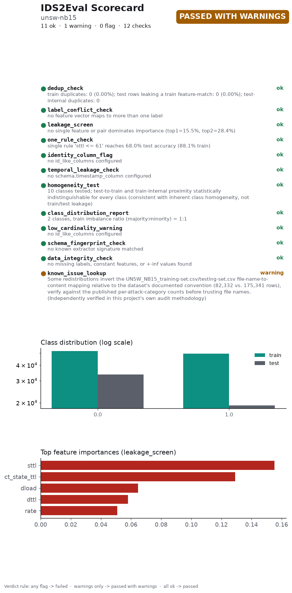

# IDS2Eval Scorecard

**Dataset:** unsw-nb15
**Overall status:** 🚩 Review Required, 16 ok, 2 warning(s), 1 flag(s)
**Generated:** 2026-10-07T10:51:19.024848+00:00
**IDS2Eval version:** 0.1.0 (git be73293)
**Scorecard schema version:** 1.3
**Verdict judged on:** cleaned data (exact duplicates removed)

A full, styled version of this scorecard is in `SCORECARD.html`.

## Checks

Findings from this run's own data. Each one can, in principle, be reacted to - by dropping a column, resampling, switching split modes, or just noting the caveat.

| # | Check | Raw data | Cleaned data | Summary |
|---|---|---|---|---|
| 1 | `dedup_check` | 🚩 flag | ✅ pass | *Evidence: statistical.* train duplicates: 0 (0.00%); test rows leaking a train feature-match: 0 (0.00%); test-internal duplicates: 0 *raw data:* train duplicates: 74,301 (42.38%); test rows leaking a train feature-match: 8,541 (10.37%); test-internal duplicates: 21,147 |
| 2 | `label_conflict_check` | 🚩 flag | ✅ pass | *Evidence: statistical.* no feature vector maps to more than one label *raw data:* 414 feature vector(s) (1,758 rows, 0.68%) map to more than one label. The ground truth contradicts itself for these rows; 279 of these span train and test |
| 3 | `near_duplicate_class_check` | 🚩 flag | ✅ pass | *Evidence: statistical.* no near-zero-distance feature vectors found across 10 classes tested *raw data:* 472 of 4,630 sampled rows (10.19%) have a near-zero-distance neighbor under a different label. Most affected pairs: {'Backdoor / DoS': 80, 'Analysis / DoS': 61, 'Backdoor / Exploits': 56, 'DoS / Exploits': 54, 'Analysis / Exploits': 44} |
| 4 | `leakage_screen` | ✅ pass | ✅ pass | *Evidence: statistical.* no single feature or pair dominates importance (top1=15.5%, top2=28.4%) *raw data:* no single feature or pair dominates importance (top1=17.8%, top2=31.0%) |
| 5 | `one_rule_check` | ✅ pass | ✅ pass | *Evidence: statistical.* single rule 'sttl <= 61' reaches 68.0% test accuracy (88.1% train), vs. 63.9% from always predicting the majority class *raw data:* single rule 'sttl <= 61' reaches 76.6% test accuracy (92.1% train), vs. 55.1% from always predicting the majority class |
| 6 | `feature_auc_ranking_check` | ✅ pass | ✅ pass | *Evidence: statistical.* 'sttl' alone reaches AUC 0.872 identifying '0.0' *raw data:* 'sttl' alone reaches AUC 0.881 identifying '0.0' |
| 7 | `identity_column_flag` | ✅ pass | ✅ pass | *Evidence: statistical.* no id_like_columns configured |
| 8 | `port_protocol_shortcut_check` | ✅ pass | ✅ pass | *Evidence: statistical.* no port-like entry in schema.id_like_columns and/or no proto-like column found, this check needs both |
| 9 | `temporal_leakage_check` | ✅ pass | ✅ pass | *Evidence: statistical.* no schema.timestamp_column configured |
| 10 | `temporal_realism_check` | ✅ pass | ✅ pass | *Evidence: statistical.* no schema.timestamp_column configured |
| 11 | `flow_group_leakage_check` | ✅ pass | ✅ pass | *Evidence: statistical.* no schema.flow_id_columns configured |
| 12 | `row_order_leakage_check` | 🚩 flag | 🚩 flag | *Evidence: statistical.* adjacent-row label-transition rate (train=0.09, test=0.00) as a share of what a randomly shuffled ordering would produce; test is the most contiguous, consistent with rows still in collection order rather than shuffled before this split *raw data:* adjacent-row label-transition rate (train=0.11, test=0.00) as a share of what a randomly shuffled ordering would produce; test is the most contiguous, consistent with rows still in collection order rather than shuffled before this split |
| 13 | `homogeneity_test` | ✅ pass | ⚠️ warn | *Evidence: statistical.* 10 classes tested; inconclusive (95% CI straddles the +/-0.05 equivalence margin) for: ['Backdoor', 'Worms']; sample size isn't enough to tell for these classes *raw data:* 10 classes tested; for every class the 95% CI upper bound on (test-to-train minus train-internal) near-duplicate rate is below the +0.05 margin, so no class shows a train/test leakage signature |
| 14 | `scenario_holdout_falsification` | ✅ pass (same on raw and cleaned data) | *Evidence: direct experiment.* no schema.scenario_column configured |
| 15 | `class_distribution_report` | ✅ pass | ✅ pass | *Evidence: statistical.* 2 classes, train imbalance ratio (majority:minority) = 1:1 *raw data:* 2 classes, train imbalance ratio (majority:minority) = 2:1 |
| 16 | `low_cardinality_warning` | ✅ pass | ✅ pass | *Evidence: statistical.* no id_like_columns configured |
| 17 | `data_integrity_check` | ✅ pass | ✅ pass | *Evidence: statistical.* no missing labels, constant features, or +-inf values found |

## Known issues

Documented facts about this dataset or the tool that produced it, from published research - not measured from this run's data, and nothing in this run's config can fix what they report.

| # | Check | Status | Summary |
|---|---|---|---|
| 1 | `schema_fingerprint_check` | ✅ pass | *Evidence: documented.* no known extractor signature matched |
| 2 | `known_issue_lookup` | ⚠️ warn | *Evidence: documented.* Some redistributions invert the UNSW_NB15_training-set.csv/testing-set.csv file-name-to-content mapping relative to the dataset's documented convention (82,332 vs. 175,341 rows), verify against the published per-attack-category counts before trusting file names. (Independently verified in this project's own audit methodology) |

## What cleaning removed

- Train: 175,341 → 101,040 rows (74,301 duplicates dropped)
- Test: 82,332 → 52,644 rows (8,541 train-leaking rows and 21,147 test-internal duplicates dropped)

## Dataset fingerprint

- Train rows: 175,341 · test rows: 82,332 · features: 42
- Train content hash: `61a614f1bec7803fef860f60c2287b8b2d800783068a4d4b9ac8121d849734fa`
- Test content hash: `486331c750ec819f7a9a5c2f4b4184879fe70b3261ceb40b2475348d61c00553`

## Citing this result

> This result was obtained on a dataset audited with IDS2Eval v0.1.0 (scorecard schema 1.3), which reported review required, 16 ok, 2 warning(s), 1 flag(s) across 19 checks. Full report: audit_report_after.json. A vector figure of this chart is at `scorecard.pdf`, ready to cite directly.

Verdict rule: any flag → review required · warnings only → passed with warnings · all ok → passed.

---
*Scorecard format inspired by structured dataset-documentation practices. Datasheets for Datasets ([arXiv:1803.09010](https://arxiv.org/abs/1803.09010)) and scorecards for synthetic data evaluation ([arXiv:2406.11143](https://arxiv.org/abs/2406.11143)).*
