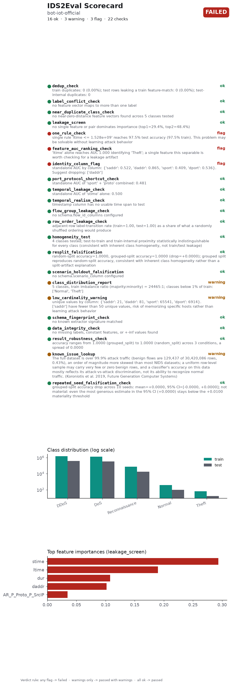

# IDS2Eval Scorecard

**Dataset:** bot-iot-official
**Overall status:** ❌ Failed, 16 ok, 3 warning(s), 3 flag(s)
**Generated:** 2026-09-28T15:09:18.521038+00:00
**IDS2Eval version:** 0.1.0
**Scorecard schema version:** 1.2
**Verdict judged on:** cleaned data (exact duplicates removed)

A full, styled version of this scorecard is in `SCORECARD.html`.

## Checks

Findings from this run's own data. Each one can, in principle, be reacted to - by dropping a column, resampling, switching split modes, or just noting the caveat.

| # | Check | Raw data | Cleaned data | Summary |
|---|---|---|---|---|
| 1 | `dedup_check` | ✅ pass | ✅ pass | *Evidence: statistical.* train duplicates: 0 (0.00%); test rows leaking a train feature-match: 0 (0.00%); test-internal duplicates: 0 |
| 2 | `label_conflict_check` | ✅ pass | ✅ pass | *Evidence: statistical.* no feature vector maps to more than one label |
| 3 | `near_duplicate_class_check` | ✅ pass | ✅ pass | *Evidence: statistical.* no near-zero-distance feature vectors found across 5 classes tested |
| 4 | `leakage_screen` | ✅ pass | ✅ pass | *Evidence: statistical.* no single feature or pair dominates importance (top1=29.4%, top2=48.4%) |
| 5 | `one_rule_check` | 🚩 flag | 🚩 flag | *Evidence: statistical.* single rule 'ltime <= 1.528e+09' reaches 97.5% test accuracy (97.5% train). This problem may be solvable without learning attack behavior |
| 6 | `feature_auc_ranking_check` | 🚩 flag | 🚩 flag | *Evidence: statistical.* 'ltime' alone reaches AUC 1.000 identifying 'Theft'; a single feature this separable is worth checking for a leakage artifact |
| 7 | `identity_column_flag` | 🚩 flag | 🚩 flag | *Evidence: statistical.* standalone AUC by column: {'saddr': 0.522, 'daddr': 0.865, 'sport': 0.409, 'dport': 0.536}. Suggest dropping: ['daddr'] |
| 8 | `port_protocol_shortcut_check` | ✅ pass | ✅ pass | *Evidence: statistical.* standalone AUC of 'sport' + 'proto' combined: 0.481 |
| 9 | `temporal_leakage_check` | ✅ pass | ✅ pass | *Evidence: statistical.* standalone AUC of 'stime' alone: 0.500 |
| 10 | `temporal_realism_check` | ✅ pass | ✅ pass | *Evidence: statistical.* timestamp column has no usable time span to test |
| 11 | `flow_group_leakage_check` | ✅ pass | ✅ pass | *Evidence: statistical.* no schema.flow_id_columns configured |
| 12 | `row_order_leakage_check` | ✅ pass | ✅ pass | *Evidence: statistical.* adjacent-row label-transition rate (train=1.00, test=1.00) as a share of what a randomly shuffled ordering would produce |
| 13 | `homogeneity_test` | ✅ pass | ✅ pass | *Evidence: statistical.* 4 classes tested; test-to-train and train-internal proximity statistically indistinguishable for every class (consistent with inherent class homogeneity, not train/test leakage) |
| 14 | `resplit_falsification` | ✅ pass (same on raw and cleaned data) | *Evidence: direct experiment.* random-split accuracy=1.0000, grouped-split accuracy=1.0000 (drop=+0.0000); grouped split reproduces random-split accuracy, consistent with inherent class homogeneity rather than a split-artifact explanation |
| 15 | `scenario_holdout_falsification` | ✅ pass (same on raw and cleaned data) | *Evidence: direct experiment.* no schema.scenario_column configured |
| 16 | `class_distribution_report` | ⚠️ warn | ⚠️ warn | *Evidence: statistical.* 5 classes, train imbalance ratio (majority:minority) = 24465:1; classes below 1% of train: ['Normal', 'Theft'] |
| 17 | `low_cardinality_warning` | ⚠️ warn | ⚠️ warn | *Evidence: statistical.* unique values by column: {'saddr': 21, 'daddr': 81, 'sport': 65541, 'dport': 6914}. ['saddr'] have fewer than 50 unique values, risk of memorizing specific hosts rather than learning attack behavior |
| 18 | `data_integrity_check` | ✅ pass | ✅ pass | *Evidence: statistical.* no missing labels, constant features, or +-inf values found |
| 19 | `result_robustness_check` | ✅ pass (same on raw and cleaned data) | *Evidence: direct experiment.* accuracy ranges from 1.0000 (grouped_split) to 1.0000 (random_split) across 3 conditions, a spread of 0.0000 |
| 20 | `repeated_seed_falsification_check` | ✅ pass (same on raw and cleaned data) | *Evidence: direct experiment.* grouped-split accuracy drop across 10 seeds: mean=+0.0000, 95% CI=[-0.0000, +0.0000]; not material: even the most generous estimate in the 95% CI (+0.0000) stays below the +0.0100 materiality threshold |

## Known issues

Documented facts about this dataset or the tool that produced it, from published research - not measured from this run's data, and nothing in this run's config can fix what they report.

| # | Check | Status | Summary |
|---|---|---|---|
| 1 | `schema_fingerprint_check` | ✅ pass | *Evidence: documented.* no known extractor signature matched |
| 2 | `known_issue_lookup` | ⚠️ warn | *Evidence: documented.* The full dataset is over 99.9% attack traffic (benign flows are 129,437 of 30,420,086 rows, 0.43%), an order of magnitude more skewed than most NIDS datasets; a uniform row-level sample may carry very few or zero benign rows, and a classifier's accuracy on this data mostly reflects its attack-vs-attack discrimination, not its ability to recognize normal traffic. (Koroniotis et al. 2019, Future Generation Computer Systems) |

## What cleaning removed

- Train: 2,934,817 → 2,934,817 rows (0 duplicates dropped)
- Test: 733,705 → 733,705 rows (0 train-leaking rows and 0 test-internal duplicates dropped)

## Dataset fingerprint

- Train rows: 2,934,817 · test rows: 733,705 · features: 42
- Train content hash: `9f5e0644a65463dc3b8846899ab4a9c321eacd6c3774c9c4dc8c03903dcde004`
- Test content hash: `3f0d0ce3cd0215c34e37d2dee89656dc3fe644ac3373d64d6bf31cb9ccd00da2`

## Citing this result

> This result was obtained on a dataset audited with IDS2Eval v0.1.0 (scorecard schema 1.2), which reported failed, 16 ok, 3 warning(s), 3 flag(s) across 22 checks. Full report: audit_report_after.json. A vector figure of this chart is at `scorecard.pdf`, ready to cite directly.

Verdict rule: any flag → failed · warnings only → passed with warnings · all ok → passed.

---
*Scorecard format inspired by structured dataset-documentation practices. Datasheets for Datasets ([arXiv:1803.09010](https://arxiv.org/abs/1803.09010)) and scorecards for synthetic data evaluation ([arXiv:2406.11143](https://arxiv.org/abs/2406.11143)).*
