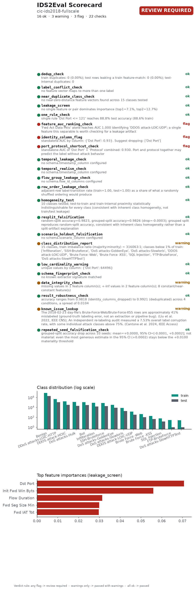

# IDS2Eval Scorecard

**Dataset:** cic-ids2018-fullscale
**Overall status:** 🚩 Review Required, 16 ok, 3 warning(s), 3 flag(s)
**Generated:** 2026-09-29T08:26:32.674483+00:00
**IDS2Eval version:** 0.1.0
**Scorecard schema version:** 1.3
**Verdict judged on:** cleaned data (exact duplicates removed)

A full, styled version of this scorecard is in `SCORECARD.html`.

## Checks

Findings from this run's own data. Each one can, in principle, be reacted to - by dropping a column, resampling, switching split modes, or just noting the caveat.

| # | Check | Raw data | Cleaned data | Summary |
|---|---|---|---|---|
| 1 | `dedup_check` | 🚩 flag | ✅ pass | *Evidence: statistical.* train duplicates: 0 (0.00%); test rows leaking a train feature-match: 0 (0.00%); test-internal duplicates: 0 *raw data:* train duplicates: 3,703,769 (28.52%); test rows leaking a train feature-match: 1,065,936 (32.83%); test-internal duplicates: 16,229 |
| 2 | `label_conflict_check` | 🚩 flag | ✅ pass | *Evidence: statistical.* no feature vector maps to more than one label *raw data:* 68,473 feature vector(s) (1,572,764 rows, 9.69%) map to more than one label. The ground truth contradicts itself for these rows; 37,871 of these span train and test |
| 3 | `near_duplicate_class_check` | 🚩 flag | ✅ pass | *Evidence: statistical.* no near-zero-distance feature vectors found across 15 classes tested *raw data:* 476 of 6,743 sampled rows (7.06%) have a near-zero-distance neighbor under a different label. Most affected pairs: {'DoS attacks-SlowHTTPTest / FTP-BruteForce': 470, 'Brute Force -Web / SQL Injection': 5, 'Brute Force -XSS / SQL Injection': 1} |
| 4 | `leakage_screen` | ✅ pass | ✅ pass | *Evidence: statistical.* no single feature or pair dominates importance (top1=7.1%, top2=12.7%) *raw data:* no single feature or pair dominates importance (top1=8.9%, top2=16.0%) |
| 5 | `one_rule_check` | ✅ pass | ✅ pass | *Evidence: statistical.* single rule 'Dst Port <= 121' reaches 88.8% test accuracy (88.6% train) *raw data:* single rule 'Fwd Seg Size Min <= 30' reaches 83.1% test accuracy (83.1% train) |
| 6 | `feature_auc_ranking_check` | 🚩 flag | 🚩 flag | *Evidence: statistical.* 'Fwd Act Data Pkts' alone reaches AUC 1.000 identifying 'DDOS attack-LOIC-UDP'; a single feature this separable is worth checking for a leakage artifact |
| 7 | `identity_column_flag` | 🚩 flag | 🚩 flag | *Evidence: statistical.* standalone AUC by column: {'Dst Port': 0.93}. Suggest dropping: ['Dst Port'] *raw data:* standalone AUC by column: {'Dst Port': 0.934}. Suggest dropping: ['Dst Port'] |
| 8 | `port_protocol_shortcut_check` | 🚩 flag | 🚩 flag | *Evidence: statistical.* standalone AUC of 'Dst Port' + 'Protocol' combined: 0.930. Port and protocol together may predict the label without attack behavior *raw data:* standalone AUC of 'Dst Port' + 'Protocol' combined: 0.934. Port and protocol together may predict the label without attack behavior |
| 9 | `temporal_leakage_check` | ✅ pass | ✅ pass | *Evidence: statistical.* no schema.timestamp_column configured |
| 10 | `temporal_realism_check` | ✅ pass | ✅ pass | *Evidence: statistical.* no schema.timestamp_column configured |
| 11 | `flow_group_leakage_check` | ✅ pass | ✅ pass | *Evidence: statistical.* no schema.flow_id_columns configured |
| 12 | `row_order_leakage_check` | ✅ pass | ✅ pass | *Evidence: statistical.* adjacent-row label-transition rate (train=1.00, test=1.00) as a share of what a randomly shuffled ordering would produce |
| 13 | `homogeneity_test` | ✅ pass | ✅ pass | *Evidence: statistical.* 10 classes tested; test-to-train and train-internal proximity statistically indistinguishable for every class (consistent with inherent class homogeneity, not train/test leakage) *raw data:* 12 classes tested; test-to-train and train-internal proximity statistically indistinguishable for every class (consistent with inherent class homogeneity, not train/test leakage) |
| 14 | `resplit_falsification` | ✅ pass (same on raw and cleaned data) | *Evidence: direct experiment.* random-split accuracy=0.9823, grouped-split accuracy=0.9826 (drop=-0.0003); grouped split reproduces random-split accuracy, consistent with inherent class homogeneity rather than a split-artifact explanation |
| 15 | `scenario_holdout_falsification` | ✅ pass (same on raw and cleaned data) | *Evidence: direct experiment.* no schema.scenario_column configured |
| 16 | `class_distribution_report` | ⚠️ warn | ⚠️ warn | *Evidence: statistical.* 15 classes, train imbalance ratio (majority:minority) = 316063:1; classes below 1% of train: ['Infilteration', 'SSH-Bruteforce', 'DoS attacks-GoldenEye', 'DoS attacks-Slowloris', 'DDOS attack-LOIC-UDP', 'Brute Force -Web', 'Brute Force -XSS', 'SQL Injection', 'FTP-BruteForce', 'DoS attacks-SlowHTTPTest'] *raw data:* 15 classes, train imbalance ratio (majority:minority) = 154111:1; classes below 1% of train: ['Infilteration', 'DoS attacks-SlowHTTPTest', 'DoS attacks-GoldenEye', 'DoS attacks-Slowloris', 'DDOS attack-LOIC-UDP', 'Brute Force -Web', 'Brute Force -XSS', 'SQL Injection'] |
| 17 | `low_cardinality_warning` | ✅ pass | ✅ pass | *Evidence: statistical.* unique values by column: {'Dst Port': 64496} |
| 18 | `data_integrity_check` | ⚠️ warn | ⚠️ warn | *Evidence: statistical.* missing values in 1 feature column(s); +-inf values in 2 feature column(s); 8 constant/near-constant feature(s) |
| 19 | `result_robustness_check` | ✅ pass (same on raw and cleaned data) | *Evidence: direct experiment.* accuracy ranges from 0.9818 (identity_columns_dropped) to 0.9921 (deduplicated) across 4 conditions, a spread of 0.0104 |
| 20 | `repeated_seed_falsification_check` | ✅ pass (same on raw and cleaned data) | *Evidence: direct experiment.* grouped-split accuracy drop across 10 seeds: mean=+0.0000, 95% CI=[-0.0001, +0.0002]; not material: even the most generous estimate in the 95% CI (+0.0002) stays below the +0.0100 materiality threshold |

## Known issues

Documented facts about this dataset or the tool that produced it, from published research - not measured from this run's data, and nothing in this run's config can fix what they report.

| # | Check | Status | Summary |
|---|---|---|---|
| 1 | `schema_fingerprint_check` | ✅ pass | *Evidence: documented.* no known extractor signature matched |
| 2 | `known_issue_lookup` | ⚠️ warn | *Evidence: documented.* The 2018-02-23 day-file's Brute-Force-Web/Brute-Force-XSS rows are approximately 41% mislabeled (ground-truth labeling error, not an extraction or pipeline bug). (Liu et al. 2022, IEEE CNS); An independent re-labeling audit measured a 7.53% overall label corruption rate, with some individual attack classes above 75%. (Cantone et al. 2024, IEEE Access) |

## What cleaning removed

- Train: 12,986,354 → 9,282,585 rows (3,703,769 duplicates dropped)
- Test: 3,246,589 → 2,164,424 rows (1,065,936 train-leaking rows and 16,229 test-internal duplicates dropped)

## Dataset fingerprint

- Train rows: 12,986,354 · test rows: 3,246,589 · features: 78
- Train content hash: `0cd88f1a0e407aee7839868efef0d10897fb919ba6a967dcbea2a7b3fc22c14a`
- Test content hash: `dcd3fc750b558cdede9a8afe3397ab7171289d9a5c05cc6e92698534d0175324`

## Citing this result

> This result was obtained on a dataset audited with IDS2Eval v0.1.0 (scorecard schema 1.3), which reported review required, 16 ok, 3 warning(s), 3 flag(s) across 22 checks. Full report: audit_report_after.json. A vector figure of this chart is at `scorecard.pdf`, ready to cite directly.

Verdict rule: any flag → review required · warnings only → passed with warnings · all ok → passed.

---
*Scorecard format inspired by structured dataset-documentation practices. Datasheets for Datasets ([arXiv:1803.09010](https://arxiv.org/abs/1803.09010)) and scorecards for synthetic data evaluation ([arXiv:2406.11143](https://arxiv.org/abs/2406.11143)).*
