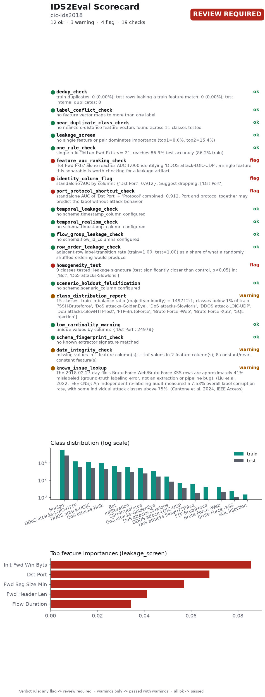

# IDS2Eval Scorecard

**Dataset:** cic-ids2018
**Overall status:** 🚩 Review Required, 12 ok, 3 warning(s), 4 flag(s)
**Generated:** 2026-09-27T02:18:25.496037+00:00
**IDS2Eval version:** 0.1.0 (git d1f0560)
**Scorecard schema version:** 1.3
**Verdict judged on:** cleaned data (exact duplicates removed)

A full, styled version of this scorecard is in `SCORECARD.html`.

## Checks

Findings from this run's own data. Each one can, in principle, be reacted to - by dropping a column, resampling, switching split modes, or just noting the caveat.

| # | Check | Raw data | Cleaned data | Summary |
|---|---|---|---|---|
| 1 | `dedup_check` | 🚩 flag | ✅ pass | *Evidence: statistical.* train duplicates: 0 (0.00%); test rows leaking a train feature-match: 0 (0.00%); test-internal duplicates: 0 *raw data:* train duplicates: 52,584 (13.15%); test rows leaking a train feature-match: 16,882 (16.88%); test-internal duplicates: 555 |
| 2 | `label_conflict_check` | 🚩 flag | ✅ pass | *Evidence: statistical.* no feature vector maps to more than one label *raw data:* 882 feature vector(s) (15,194 rows, 3.04%) map to more than one label. The ground truth contradicts itself for these rows; 481 of these span train and test |
| 3 | `near_duplicate_class_check` | 🚩 flag | ✅ pass | *Evidence: statistical.* no near-zero-distance feature vectors found across 11 classes tested *raw data:* 475 of 5,317 sampled rows (8.93%) have a near-zero-distance neighbor under a different label. Most affected pairs: {'DoS attacks-SlowHTTPTest / FTP-BruteForce': 474, 'Benign / DoS attacks-GoldenEye': 1} |
| 4 | `leakage_screen` | ✅ pass | ✅ pass | *Evidence: statistical.* no single feature or pair dominates importance (top1=8.6%, top2=15.4%) *raw data:* no single feature or pair dominates importance (top1=8.9%, top2=16.4%) |
| 5 | `one_rule_check` | ✅ pass | ✅ pass | *Evidence: statistical.* single rule 'TotLen Fwd Pkts <= 21' reaches 86.9% test accuracy (86.2% train) *raw data:* single rule 'Fwd Seg Size Min <= 30' reaches 83.0% test accuracy (83.2% train) |
| 6 | `feature_auc_ranking_check` | 🚩 flag | 🚩 flag | *Evidence: statistical.* 'Tot Fwd Pkts' alone reaches AUC 1.000 identifying 'DDOS attack-LOIC-UDP'; a single feature this separable is worth checking for a leakage artifact |
| 7 | `identity_column_flag` | 🚩 flag | 🚩 flag | *Evidence: statistical.* standalone AUC by column: {'Dst Port': 0.912}. Suggest dropping: ['Dst Port'] *raw data:* standalone AUC by column: {'Dst Port': 0.925}. Suggest dropping: ['Dst Port'] |
| 8 | `port_protocol_shortcut_check` | 🚩 flag | 🚩 flag | *Evidence: statistical.* standalone AUC of 'Dst Port' + 'Protocol' combined: 0.912. Port and protocol together may predict the label without attack behavior *raw data:* standalone AUC of 'Dst Port' + 'Protocol' combined: 0.925. Port and protocol together may predict the label without attack behavior |
| 9 | `temporal_leakage_check` | ✅ pass | ✅ pass | *Evidence: statistical.* no schema.timestamp_column configured |
| 10 | `temporal_realism_check` | ✅ pass | ✅ pass | *Evidence: statistical.* no schema.timestamp_column configured |
| 11 | `flow_group_leakage_check` | ✅ pass | ✅ pass | *Evidence: statistical.* no schema.flow_id_columns configured |
| 12 | `row_order_leakage_check` | ✅ pass | ✅ pass | *Evidence: statistical.* adjacent-row label-transition rate (train=1.00, test=1.00) as a share of what a randomly shuffled ordering would produce |
| 13 | `homogeneity_test` | ✅ pass | 🚩 flag | *Evidence: statistical.* 9 classes tested; leakage signature (test significantly closer than control, p<0.05) in: ['Bot', 'DoS attacks-Slowloris'] *raw data:* 11 classes tested; test-to-train and train-internal proximity statistically indistinguishable for every class (consistent with inherent class homogeneity, not train/test leakage) |
| 14 | `scenario_holdout_falsification` | ✅ pass (same on raw and cleaned data) | *Evidence: direct experiment.* no schema.scenario_column configured |
| 15 | `class_distribution_report` | ⚠️ warn | ⚠️ warn | *Evidence: statistical.* 15 classes, train imbalance ratio (majority:minority) = 149712:1; classes below 1% of train: ['SSH-Bruteforce', 'DoS attacks-GoldenEye', 'DoS attacks-Slowloris', 'DDOS attack-LOIC-UDP', 'DoS attacks-SlowHTTPTest', 'FTP-BruteForce', 'Brute Force -Web', 'Brute Force -XSS', 'SQL Injection'] *raw data:* 15 classes, train imbalance ratio (majority:minority) = 166034:1; classes below 1% of train: ['DoS attacks-SlowHTTPTest', 'DoS attacks-GoldenEye', 'DoS attacks-Slowloris', 'DDOS attack-LOIC-UDP', 'Brute Force -Web', 'Brute Force -XSS', 'SQL Injection'] |
| 16 | `low_cardinality_warning` | ✅ pass | ✅ pass | *Evidence: statistical.* unique values by column: {'Dst Port': 24978} |
| 17 | `data_integrity_check` | ⚠️ warn | ⚠️ warn | *Evidence: statistical.* missing values in 1 feature column(s); +-inf values in 2 feature column(s); 8 constant/near-constant feature(s) |

## Known issues

Documented facts about this dataset or the tool that produced it, from published research - not measured from this run's data, and nothing in this run's config can fix what they report.

| # | Check | Status | Summary |
|---|---|---|---|
| 1 | `schema_fingerprint_check` | ✅ pass | *Evidence: documented.* no known extractor signature matched |
| 2 | `known_issue_lookup` | ⚠️ warn | *Evidence: documented.* The 2018-02-23 day-file's Brute-Force-Web/Brute-Force-XSS rows are approximately 41% mislabeled (ground-truth labeling error, not an extraction or pipeline bug). (Liu et al. 2022, IEEE CNS); An independent re-labeling audit measured a 7.53% overall label corruption rate, with some individual attack classes above 75%. (Cantone et al. 2024, IEEE Access) |

## What cleaning removed

- Train: 400,000 → 347,416 rows (52,584 duplicates dropped)
- Test: 100,000 → 82,563 rows (16,882 train-leaking rows and 555 test-internal duplicates dropped)

## Compared to the previous run

Compared to `2026-09-26_073029_397903` (2026-09-26T07:34:46.480552+00:00).
No check's status changed since the previous run.

## Dataset fingerprint

- Train rows: 400,000 · test rows: 100,000 · features: 78
- Train content hash: `d659a2f4841244f0beca91dbcf0f247f0ea8b4321167c34322a68319961cc886`
- Test content hash: `a993f8e271abf51a2d9ceb601b871397dbd5c8f202230779356987433c3cf281`

## Citing this result

> This result was obtained on a dataset audited with IDS2Eval v0.1.0 (scorecard schema 1.3), which reported review required, 12 ok, 3 warning(s), 4 flag(s) across 19 checks. Full report: audit_report_after.json. A vector figure of this chart is at `scorecard.pdf`, ready to cite directly.

Verdict rule: any flag → review required · warnings only → passed with warnings · all ok → passed.

---
*Scorecard format inspired by structured dataset-documentation practices. Datasheets for Datasets ([arXiv:1803.09010](https://arxiv.org/abs/1803.09010)) and scorecards for synthetic data evaluation ([arXiv:2406.11143](https://arxiv.org/abs/2406.11143)).*
