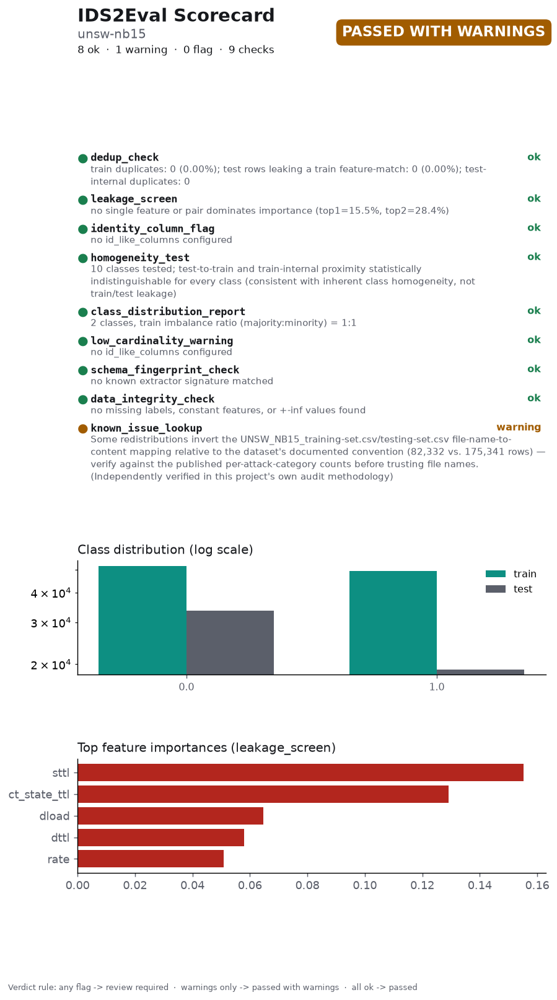

# IDS2Eval Scorecard

**Dataset:** unsw-nb15
**Overall status:** ⚠️ Passed with warnings, 8 ok, 1 warning(s), 0 flag(s)
**Generated:** 2026-09-24T18:12:21.469392+00:00
**IDS2Eval version:** 0.1.0 (git 05b5e54)
**Scorecard schema version:** 1.3
**Verdict judged on:** cleaned data (exact duplicates removed)

A full, styled version of this scorecard is in `SCORECARD.html`.

## Checks

Findings from this run's own data. Each one can, in principle, be reacted to - by dropping a column, resampling, switching split modes, or just noting the caveat.

| # | Check | Raw data | Cleaned data | Summary |
|---|---|---|---|---|
| 1 | `dedup_check` | 🚩 flag | ✅ pass | train duplicates: 0 (0.00%); test rows leaking a train feature-match: 0 (0.00%); test-internal duplicates: 0 *raw data:* train duplicates: 74,301 (42.38%); test rows leaking a train feature-match: 8,541 (10.37%); test-internal duplicates: 21,147 |
| 2 | `leakage_screen` | ✅ pass | ✅ pass | no single feature or pair dominates importance (top1=15.5%, top2=28.4%) *raw data:* no single feature or pair dominates importance (top1=17.8%, top2=31.0%) |
| 3 | `identity_column_flag` | ✅ pass | ✅ pass | no id_like_columns configured |
| 4 | `homogeneity_test` | ✅ pass | ✅ pass | 10 classes tested; test-to-train and train-internal proximity statistically indistinguishable for every class (consistent with inherent class homogeneity, not train/test leakage) |
| 5 | `class_distribution_report` | ✅ pass | ✅ pass | 2 classes, train imbalance ratio (majority:minority) = 1:1 *raw data:* 2 classes, train imbalance ratio (majority:minority) = 2:1 |
| 6 | `low_cardinality_warning` | ✅ pass | ✅ pass | no id_like_columns configured |
| 7 | `data_integrity_check` | ✅ pass | ✅ pass | no missing labels, constant features, or +-inf values found |

## Known issues

Documented facts about this dataset or the tool that produced it, from published research - not measured from this run's data, and nothing in this run's config can fix what they report.

| # | Check | Status | Summary |
|---|---|---|---|
| 1 | `schema_fingerprint_check` | ✅ pass | no known extractor signature matched |
| 2 | `known_issue_lookup` | ⚠️ warn | Some redistributions invert the UNSW_NB15_training-set.csv/testing-set.csv file-name-to-content mapping relative to the dataset's documented convention (82,332 vs. 175,341 rows) — verify against the published per-attack-category counts before trusting file names. (Independently verified in this project's own audit methodology) |

## What cleaning removed

- Train: 175,341 → 101,040 rows (74,301 duplicates dropped)
- Test: 82,332 → 52,644 rows (8,541 train-leaking rows and 21,147 test-internal duplicates dropped)

## Dataset fingerprint

- Train rows: 175,341 · test rows: 82,332 · features: 42
- Train content hash: `61a614f1bec7803fef860f60c2287b8b2d800783068a4d4b9ac8121d849734fa`
- Test content hash: `486331c750ec819f7a9a5c2f4b4184879fe70b3261ceb40b2475348d61c00553`

## Citing this result

> This result was obtained on a dataset audited with IDS2Eval v0.1.0 (scorecard schema 1.3), which reported passed with warnings, 8 ok, 1 warning(s), 0 flag(s) across 9 checks. Full report: audit_report_after.json. A vector figure of this chart is at `scorecard.pdf`, ready to cite directly.

Verdict rule: any flag → review required · warnings only → passed with warnings · all ok → passed.

---
*Scorecard format inspired by structured dataset-documentation practices. Datasheets for Datasets ([arXiv:1803.09010](https://arxiv.org/abs/1803.09010)) and scorecards for synthetic data evaluation ([arXiv:2406.11143](https://arxiv.org/abs/2406.11143)).*
